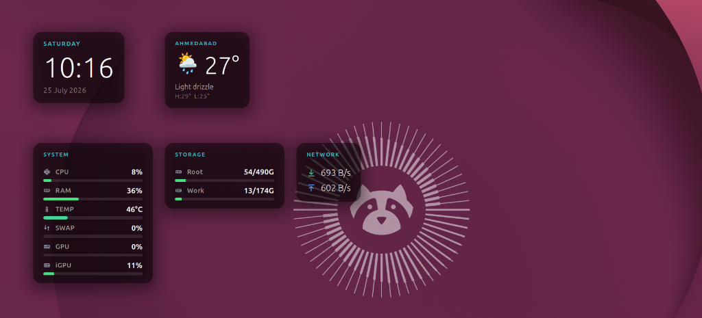

# Aether Widgets

A modern, desktop-native **widget library for GNOME Shell** (supporting GNOME Shell versions 48, 49, and 50, e.g. Ubuntu 24.04 LTS through 26.04+).

Written in **GJS** (GNOME JavaScript Engine), Aether Widgets runs natively inside the shell process to display sleek, glassmorphic desktop cards anchored to your wallpaper layer.



---

## ✨ Features & Included Widgets

Aether Widgets comes out of the box with 5 customizable desktop widgets:

* 🕒 **Clock**: Displays the current day of the week, time (`HH:MM`), and date with custom typography and accent highlights.
* 💻 **System Monitor**: Real-time hardware performance monitoring:
  * **CPU Usage**: Multi-core processor utilization percentage and optional CPU core temperature monitoring (`°C`).
  * **RAM Usage**: Memory consumption percentage with progress bar visualization.
  * **Swap Usage**: Optional swap memory monitoring.
  * **GPU Usage & VRAM**: AMD GPU & iGPU load detection and dedicated VRAM usage (with automatic runtime power suspend detection).
* 💾 **Storage**: Live disk space monitoring across physical filesystems (`/`, `/home`, mounted partitions), displaying total and used gigabytes with dynamic color indicators.
* 🌐 **Network**: Real-time download (`↓`) and upload (`↑`) network throughput meters per second across physical interfaces.
* 🌤️ **Weather**: Live atmospheric weather reporting:
  * Current temperature, condition descriptions, WMO weather condition icons, and daily high/low forecast range.
  * **Auto Geolocation**: IP-based automatic location lookup (`ipapi.co`) or manual latitude/longitude & city name configuration.
  * Temperature unit support (**Celsius** `°C` or **Fahrenheit** `°F`).

---

## 🎮 Desktop Interactivity: Moving & Placing Widgets

Widgets are anchored to the wallpaper layer so they don't block workspace interactions. To reposition widgets on your desktop:

1. **Enter Edit Mode**:
   * Click the **Lock / Edit Icon** (`🔒` / `✏️`) added to your GNOME panel (top bar).
   * Or press the global keyboard shortcut: **`Super + Alt + W`**.
2. **Move Widgets**:
   * The edit banner will appear at the top of your screen.
   * **Click and drag** any widget card across your desktop to place it where you want.
3. **Save & Exit**:
   * Press **`Esc`** or click the panel icon again to lock the widgets back onto the desktop. Positions are saved automatically.

---

## ⚙️ Configuration & Customization

Open Extension Preferences to customize aesthetics and widget behavior:

```bash
gnome-extensions prefs [email protected]
```

*(Alternatively, open the **Extensions** or **Extension Manager** application and click **Settings** next to Aether Widgets).*

### Available Settings

* **Widgets Toggle**: Turn individual widgets (**Clock**, **System monitor**, **Storage**, **Network**, **Weather**) on or off.
* **Appearance**:
  * **Accent Colour**: Interactive color picker for card headers and highlights.
  * **Card Opacity**: Adjust background glassmorphism opacity from `0.00` (transparent) to `1.00` (solid).
* **System Monitor Options**:
  * **GPU Display**: Choose between showing `All GPUs`, `Primary only`, or turning GPU monitoring `Off`.
  * **CPU Temp**: Toggle CPU temperature monitoring.
  * **Swap**: Toggle swap memory usage display.
* **Weather Options**:
  * **Detect Location Automatically**: IP-based auto location.
  * **Manual Coordinates**: Custom Latitude, Longitude, and Location Display Name.
  * **Temperature Unit**: Choose Celsius (`°C`) or Fahrenheit (`°F`).

---

## 🚀 Installation Guide

### System Requirements

* **GNOME Shell**: Versions `48`, `49`, or `50` (Wayland or X11 session).
* **Dependencies**: `gnome-shell`, `glib-compile-schemas` (`libglib2.0-bin`), and `libsoup-3.0` (standard on GNOME systems).

### Manual Installation (From Source)

1. **Clone the repository**:
   ```bash
   git clone https://github.com/bhadreshpsavani/aether-widgets.git
   cd aether-widgets
   ```

2. **Create the extension directory & link/copy files**:
   ```bash
   mkdir -p ~/.local/share/gnome-shell/extensions/
   ln -s "$PWD" ~/.local/share/gnome-shell/extensions/[email protected]
   ```

3. **Compile GSettings Schemas**:
   ```bash
   glib-compile-schemas schemas/
   ```

4. **Enable the Extension**:
   ```bash
   gnome-extensions enable [email protected]
   ```

5. **Restart GNOME Shell**:
   * **Wayland**: Log out and log back in (or restart your desktop session).
   * **X11**: Press `Alt + F2`, type `r`, and press `Enter`.

---

## 📁 Project Structure

```
aether-widgets/
├── extension.js        # Main extension lifecycle (enable/disable, hotkeys, panel button)
├── metadata.json       # UUID, GNOME Shell compatibility, schema metadata
├── prefs.js            # LibAdwaita preferences window UI
├── stylesheet.css      # Modern dark glassmorphic styling
├── LICENSE             # MIT License
├── lib/
│   ├── base.js         # BaseWidget class (draggable actor, config bindings)
│   ├── meter.js        # UI helper utilities (progress bars, status colors)
│   └── registry.js     # Widget mount/unmount & layout manager registration
├── widgets/
│   ├── clock.js        # Clock widget
│   ├── network.js      # Network throughput monitor
│   ├── storage.js      # Storage & filesystem usage monitor
│   ├── sysmon.js       # CPU, RAM, Swap & GPU monitor
│   └── weather.js      # Weather forecast & geolocation widget
├── icons/              # Custom SVG icon set
├── screenshots/        # Desktop preview screenshots
└── schemas/            # GSettings schema XML & compiled schema
```

---

## 🛠️ Developer Guide: Create Your Own Widget

Aether Widgets features an extensible architecture via `BaseWidget` and `WidgetRegistry`.

### 1. Create a Widget Class

Add a new file in `widgets/hello.js`:

```js
import GObject from 'gi://GObject';
import St from 'gi://St';
import { BaseWidget } from '../lib/base.js';

export const HelloWidget = GObject.registerClass(
class HelloWidget extends BaseWidget {
    _build() {
        const label = new St.Label({
            text: 'Hello, Desktop!',
            style: `color: ${this.accent}; font-size: 16px; font-weight: bold;`,
        });
        this.add_child(label);
    }
});
```

### 2. Register the Widget

In `extension.js`, import and register your widget:

```js
import { HelloWidget } from './widgets/hello.js';

// Inside enable():
this._registry.register('hello', HelloWidget);
```

### 3. Debug & View Live Logs

Monitor GNOME Shell extension logs in real-time:

```bash
journalctl -f -o cat /usr/bin/gnome-shell
```

---

## 🔍 Troubleshooting & Notes

* **GPU Monitoring Note**: The System Monitor widget currently supports AMD GPUs reading from sysfs (`/sys/class/drm/card*/device/gpu_busy_percent`). Discrete GPUs in dynamic power-save mode will display **`Suspended`** until activated by GPU workloads. NVIDIA/Intel sysfs nodes vary and display `--` if missing.
* **Schema Error**: If widget preferences fail to launch or throw errors, re-compile schemas manually: `glib-compile-schemas schemas/`.

---

## 📄 License

This project is licensed under the **MIT License**. See [LICENSE](LICENSE) for details.

